## Doctor Chick Design Briefing

###Establishing a Narrative
The game begins as the user selects an adventure or enters a file number (aka seed). The loading scene shows us our location: at a university somewhere prestigious. Dr. Chick is wrapping up a lecture and a few students are in the picture. His dialogue ends, "... so that's how the **Case of the Golden Sword** finally ended." If the player previous has played another advenuture, this will be the name of the last adventure played. 

An older gentleman enters the classroom and tells Dr. Chick that some new benefactors have discovered a clue to the **Silver Dagger of Evil**, or whatever the name of the artifact key to the current game is, and that they want to send him on an expedition to locate it. Dr. Chick is to choose an assitant to join him on his trip. He can choose from the students who are in the lecture hall. Each may have a strength: better fighter, able to detect traps, able to recognize the weaknesses of creatures, etc.

Once the player agrees, another loading scene appears that shows a little airplane moving across a map to the location of the proposed expedition. The first map loads. In its initial implementation, Doctor Chick is a turn-based game. If feasible, in a later version, it would be great to have a pseudo real-time implementation -- aka dynamic turn based.

Unlike many other roguelike games, this game has the player visit a series of different locations. The culmination of each part of the expedition will be a clue that is needed to proceed in the next segment. The first segment will be the shortest, with 3 levels (or so) on the map. The second segment will have ~ 10 levels, the final segment will have 15 levels. The first segment may be in a forest area in South America, the second in an ice cave in Antarctica, and the third in a rainforest temple, for example.

The levels will lean more towards non-magical items, weapons, and treasures, but magical and mystical items occassionally will be available. Inspired by the Indiana Jones, movies, there will be ample opportunity to discover traps, figure out how to disarm them, and how to sneak into a sacred place to steal treasure. The player's score will be determined by how much treasure is picked up and how quickly each segment of the expedition concludes. 

The assistant will be able to assist Dr. Chick. When Dr. is moving, the assistant follows. If the assistant ever is in Dr. Chick's way, moving in the direction of the assistant will cause the two of them to swap places. Doctor Chick can tell the assistant to move towards another destination and to wait there. So, basically, the assistant, at any given point in time, either is following Dr. Chick, moving towards a destination that Dr. Chick specifies, or waiting at a location that Dr. Chick specifies. This may be useful when trying to trigger tricky traps, open doors that require two switches to be pushed, or when trying to plan an ambush. If the assistant dies and Dr. Chick completes the segment, he is able to choose another assistant, but loses a benefactor. If Dr. Chick loses all benefactors, he is fired and the game is over. Losing assistants and benefactors may or may not affect the final score.

Like any good treasure-hunting movie/game/story, there's a rival who is trying to get the treasure first. The rival and his assistants will provide some tension and competition in the game. It would be awesome, in a later version, to implement a two-player mode and have the second player be the rival. But that is a loooooooooong way down the road.

As the game progresses, the levels become more challenging. To win the adventure, the player must safely reach the artifact in question and either return with it, if it can be picked up, or otherwise activate it, and then safely return back to the airplane and return to the university. Abandoning the assistant and leaving in the airplane alone counts as an assistant death.

### Winning and Losing the Game

#### Benefactors

#### "Ascension"

#### Defeat
Doctor Chick doesn't die. If he is defeated in combat, a scene will show where his arch enemy rubs his defeat in his face and mutters something like, "Until we meet again, Doctor Chick!" followed by maniacal laughter, of course.

### Core Conflict in the Game
Doctor Chick is a game that pits the player in challenges against both the ordinary and magical, as he raids tombs, caverns, caves, archaeological dig sites, and lairs to retrieve artifacts for his university. Inspired by a combination of Indiana Jones and Brogue, players of Doctor Chick will feel a sense of excitement during exploration, as they seek the dark and hidden corners of the map that contain secrets and treasure that propel them on their quest. 

All is not a cakewalk, however, as Doctor Chick's rivals also seek the same treasure and will do anything to beat him to it or take it from him.

-----

### Art and Visual

##### Visual Style
The visual style is an open-ended question at this point in time. The existing tileset graphics were created by me. Absent a better artist taking a significant interest in this project, I probably will continue to make placeholder graphics, as needed.

##### Locations: Maps and Tilesets
The initial *locations* in the game will be:

* Grasslands
* Tundra / Ice
* Desert

Each location will require a variety of terrain types. 

* Grasslands
    * Deep Grass
	* Grass
	* Light Grass
	* Dirt
	* Water
	* Deep water
	* Brick
	* Dirty brick
* Tundra / Ice
    * TBD
* Desert
    * TBD
	
Creating tileset requires understanding the transitions that need to occur between the tiles. It is far easier to have a particular type of tile contained within - and only within - another type of tile. For example, to have brick contained entirely within dirty brick. For example:

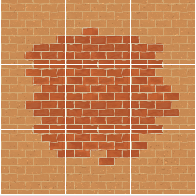

Nested transitions remove the need to create special corner tiles where multiple different types of terrain come together and they are supported better in [Tiled](http://www.mapeditor.org). 

As an example of problems that emerge with a wide variety of tiles, consider this problem, where there clearly is an out-of-place dirty brick tile:

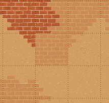

The problem is that this tileset uses the nested approach to creating terrain types, but allows for brick to be nested within dirt and dirty brick to be nested within dirt. Since brick also can be nested within dirty brick, and vice versa, there's a missing set of tiles (by the baseline design) where dirt, brick, and dirty brick all need to come together. The multi-nested approach provides more variety, but at the expense of simplicity.

Existing tiles are in the Grasslands tileset and have the following transitions are:

Deep grass surrounding Grass:
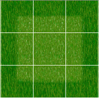

Grass surrounding Deep Grass:
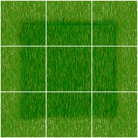

Grass surrounding Light Grass:
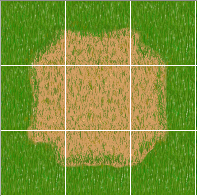

Light Grass surrounding Grass:
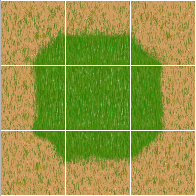

Grass surrounding Water:
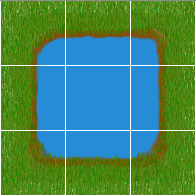

Water surrounding Grass:
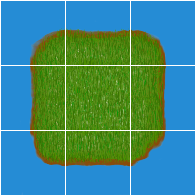

Water surrounding Deep Water:
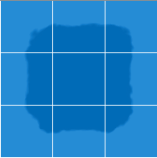

Deep Water surrounding Water:

Dirt surrounding Light Grass:
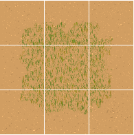

Light Grass surrounding Dirt:
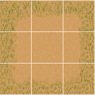

Dirt surrounding Brick:
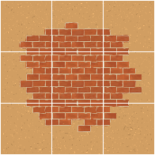

Brick surrounding Dirt:
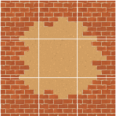

Brick surrounding Dirty Brick:
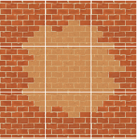

Dirty Brick surrounding Brick:
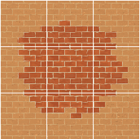

Dirty Brick surrounding Dirt:
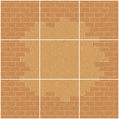

Dirt surrounding Dirty Brick:
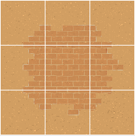

There is overlap in the way these tiles are designed. For example, the upper-left tile in "Brick surrounding Dirty Brick" also could function, if rotated, as the lower-left, lower-right, and upper-right tiles. Furthermore, the upper-center tile in "Brick surrounding Dirty Brick" could function, rotated, as the lower-center tile in the same tileset, or even as a number of tiles in the "Dirty Brick surrounding Brick" set.

I experimented with these approaches when drawing the tilesets and determined that the resulting maps look better if there are multiple tiles that can fit any given spot -- prevents repetition -- and also that they are easier to create where duplicated are made. The tradeoff is that duplicate tiles consume graphics memory. 

I suggest that we continue with this approach until we determine whether we need to reduce the number of tiles to improve graphics performance, in which case we can make the change. I suspect that it will not present a problem because we can clear from memory textures that we aren't using and we will load map templates that only contain specific tilesets to optimize and improve map randomization. For example, we will have a grasslands.tmx file that only contains the tiles specific to the grasslands set (along with other assests required).

Note that each map template will require two versions: one for standard displays and one for retina displays. This is done by doubling the size of the tiles in the .tmx file and including double-sized graphics. For each:

* map.tmx
* tiles.png

There needs to be:

* map-hd.tmx
* tiles-hd.png

Cocos2d will handle the importing and display of the proper files.

##### Environment & Art 

-----

### Main Character

#### Main Character Description and Statistics
The main character of the story, Doctor Chick (no first name given?) is a professor of archaeology and anthropology at a prominent university. He is experienced in adventure and often is dispatched by benefactors to the university to acquire mysterious and power artifacts. 

He possesses the following characteristics:

* **strength**: affects the damage he deals when he hits a target
* **power**: affects his ability to control and use mystical/magical objects and weapons
* **defense**: affects his chance to avoid attacks and to mitigate damage when hit. It has invisible sub-components of **fire defense**, **electricity defense**, **poison defense**, and **cold defense**.
* **dexterity**: greatly affects his chance to hit ranged targets; minor effect on melee
* **stamina**: gives him the ability to move quickly for a limited time
* **courage**: the most fluid of his traits, courage affects his ability to strike first and provides a damage bonus when attacking
* **awareness**: affects his ability to detect traps and decipher puzzles
* **attack**: This is an invisible value derived from the other characteristics and the weapon being wielded and is used in combat calculations. It has invisible sub-components of **fire attack*, **electricity attack**, **poison attack**, and **cold attack**

#### Main Character Progression
The main character's progression is marked more by access to improved gear than by experience points or stats from rolling dice. Inspired by Brogue, there will be artifacts, objects, and potions that can be used a single time to give the player a bonus. That bonus sometimes will last for only a few turns and sometimes will be permanent to the adventure. There may be special bonuses that carry across a string of successful adventures, but are reset when the player is defeated. See the next section for more information.

##### Main Character Development across Adventures
When a player successfully completes an adventure and returns with the Artifact of Interest, the player begins a streak. Subsequent adventures build upon the player's score and/or prestige until such time as the player is defeated on a mission. This causes a reset of the player's score/prestige. 

With "seed challenges" common in the roguelike scene, the player can begin and end a seeded adventure without interrupting progression on the main adventure line. Seeds provide one-off adventures that do not factor into the character progression described above.

If the player is in the middle of an adventure and wants to play a seed challenge, he can return to the main menu and effectively "pause" or save the adventure and start the seed challenge. At any time, the player can return to the main menu and continue to original adventure. At any given point in time, a player can have one game in progress on the main adventure line and one seed game in progress. To start a second seed game, the player must first quit a seed game in progress, if there is one.

#### Main Character Actions and Abilities
There are several actions that the player can take with the main character. The most primary of those is movement. 

##### Movement
###### Stealth Mode?
##### Searching
##### Activating
##### Attacking
##### Commanding the Sidekick

#### Line of Sight and Line of Fire
The concepts of Line of Sight (LoS) and Line of Fire (LoF) are identical in Doctor Chick. Depending on the weapon in use, however, the player may not be able to use a ranged weapon to hit everything that he can see. This is not made apparent in the interface, rather, the player must first fire a ranged weapon before learning its range. Some ranged weapons may have an unlimited range (such as a pistol) while others may have a limited range (whip or boomerang).

#### Hunger => Minor Artifact Retrieval
Hunger plays an important role in many roguelike games because it creates a sense of urgency. Doctor Chick, however, does not have the concept of hunger. Instead, it has a very similar concept that is based on artifact recovery. The player must please benefactors by locating and retrieving minor artifacts. There is a timer, similar to that of hunger, whereby if too much time passes without the player locating a minor artifact, then the benefactors lose interest and cease funding the adventure.

When the player finds a minor artifact, he can choose to use it as a weapon or to "stow" it for the benefactors. The player received the bonus for pleasing the benefactors upon stowing the artifact. Once the player stows an artifact, it is no longer available to use as a weapon. Artifacts used as weapons will degrade in quality but never break. If the user stows a degraded artifact, it does not please the benefactors as much. *The design goal with this is to create a bit of tension around whether the player should use good items that he finds.*

#### Healing

#### Controlling the Main Character

-----

### Sidekick

#### AI Implementation for the Sidekick

#### Controlling the Sidekick

-----

### Arch Rival

-----

### Bad Guys and Monsters

#### AI Implementation for Bad Guys and Monsters

-----

### Artifacts
#### The Main Artifact of Interest
#### Minor Artifacts

-----

### Random Map Generation

##### Locations and Levels

##### Entry and Exit Points

##### Puzzles and Clues

##### Traps

-----

### Items and Inventory

##### Item Generation Overview

##### Prefixes | "Descriptors"

##### Objects

##### Suffixes | "Types"

### The Use of Items
#### Wielding
#### Melee
#### Ranged
#### Throwing
#### Activating
#### Dropping
#### Consuming
#### Viewing (for puzzle pieces?)
#### Wear and Tear
Artifacts that haven't been used as weapons, etc... make the benefactors happier.

#### Weapons

#### Magic

-----

### Combat Mechanics
Facing is important to combat in Doctor Chick. If he is facing the enemy he is attacking, he will attack at 100% strength. If he has to first turn to face the opponent, his attack will lose strength, though it will be execute in the same turn. Doctor Chick's facing is determined by the last direction of movement. Each move consists of the ability to move on the map, to a different tile, and the ability to turn. The player does not have to execute the turn to complete the move.

-----

### Scoring

